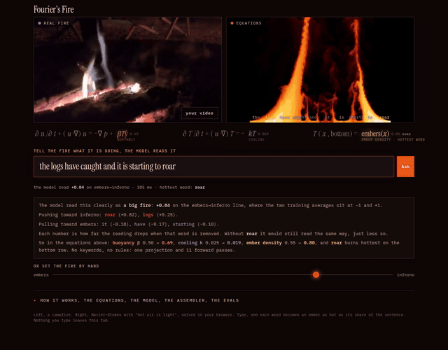

# Fourier's Fire



Live: https://huggingface.co/spaces/Unt1l1f1nd/fouriers-fire · the same clip as a video: [renders/demo.mp4](renders/demo.mp4)

The 1990s demoscene fire effect read as physics, the one line it was missing,
a real campfire next to both, and a sentence model whose words become the
embers.

## How this happened

On the evening of 7 September 2026 the LifeHeck team went camping. There was a
fire. There were, within two metres of the fire, four open laptops, because it
was a hackathon and nobody had told the fire. Someone asked whether the wifi
reached the tent. Someone else filmed the fire on a phone, which is the video
on the left of the page.

My boss looked at the flames and remembered a fire effect from the 1990s, done
in under 256 bytes of assembler, where the assembler wrote the assembler.
I said I could do that. I did it in eleven lines of JavaScript, with the real
fire in front of me for reference. I lost, on bytes. Then I noticed the eleven
lines were Fourier's heat equation with an updraft typed in as a constant, and
that the real fire was doing something the trick could not: puffing. Hot air is
light. The rest of the night went into that one line, and then into a small
model that reads a sentence and turns its words into embers, because everyone
at the fire had opinions about what the fire was doing and none of them agreed.

The fire went out around two. The equations did not.

## Three fires

1. **The trick**, `fire.js`, 11 lines. Every cell copies the cell below it,
   takes a random step sideways, averages with its neighbours, cools a bit.
   In the limit:

   ```
   ∂T/∂t = D ∂²T/∂x² − v ∂T/∂y − kT
   ```

   Fourier's heat equation (1822) with a constant updraft. No buoyancy, so no
   puffing: its flicker spectrum is flat.

2. **The equations**, `fluid.js`, about ninety lines. Navier–Stokes with the
   Boussinesq approximation, solved Stam-style (semi-Lagrangian advection,
   Jacobi pressure solve, one step per frame):

   ```
   ∂u/∂t + (u·∇)u = −∇p + β T ŷ + ε (N × ω)
   ∇·u = 0
   ∂T/∂t + (u·∇)T = −kT
   ```

   The β term is "hot air is light". It puffs.

3. **The campfire**, `campfire-a.mp4` and `campfire-b.mp4`, filmed
   7 September 2026. `sample.mp4` is an 8 s loop the page opens with.

## How it works, in one screen

1. You type a sentence. all-MiniLM-L6-v2 (22M parameters, in the tab) turns it into a point in 384 dimensions.
2. At load the same model embedded 16 "roaring" and 16 "dying" sentences. The line between the two averages is the direction. Adding it to a model's activations is what people call a steering vector. Here it is read, not added.
3. Your point is projected onto that line. + is a big fire, − is embers, the two training averages sit at ±1. That one number sets buoyancy, cooling and ember density.
4. Each word is removed in turn and the sentence re-embedded. The drop is that word's share, and its share is its heat on the bottom row.
5. No keywords, no regex, no rules on the page. The eval keeps a dictionary as a baseline to beat, nothing else.

## Evals

`evals/cases.json` holds 40 held-out sentences (20 big, 20 embers); none is among the 32 anchors. `node evals/run.mjs` scores the shipped `space/probe.js` and writes `evals/<date>-minilm.md`. The Space has the same eval at `eval.html`, run in the browser.

| | of 40 |
|---|---|
| direction alone (shipped, 16+16 anchors) | **30** |
| direction alone, first version (8+8) | 26 |
| chance | 20 |
| control: 20 random directions, same centre | mean 20.8, best 28 |
| control: anchors with shuffled labels, 20 times | mean 20.6, best 29 |
| anchors leave-one-out, of 32 | 25 |
| hottest word as a human would pick | 19 |

Big fires 11/20, embers 19/20. The controls say the direction is real and not strong: a lucky random direction reaches 28. Forty sentences, all by the author of the anchors, is a small test; sentences from other people are the next step. It knows "inferno"; it does not know that "more wood please" means the same. Negation is beyond it.

## The model

all-MiniLM-L6-v2 (22M parameters) via transformers.js, in the browser.
At load, eight "roaring" and eight "dying" sentences are embedded and the
difference of their means is a direction. Your sentence is projected onto it;
the projection sets β, k and p. Then each word is removed in turn and the drop
in projection is that word's heat on the bottom row.

What the direction turned out to mean, read off 441 words placed on it: cold end fading, tiny, faded, goodbye, empty, faint; hot end roaring, raging, blazing, fiery, inferno, rise, erupt, surge. An axis of fading versus force with a fire accent, not fire itself.

Honest names for what this is: a concept direction by difference of means in
the encoder's output space (the same construction contrastive activation
addition uses for steering vectors, but nothing here is steered: there is no
layer after the pooled vector), read as a linear probe; and occlusion
attribution per word. It is not attention and it is not an LLM.

## Live

https://huggingface.co/spaces/Unt1l1f1nd/fouriers-fire — a static Space. `space/index.html` is the easy UI: two fires, the sentence box with an Ask button, a hand slider from embers to inferno. `space/about.html` is the whole page. Edit `space/index.src.html`, not `space/index.html`. Rebuild and redeploy:

```
python3 build.py
cd space && /usr/bin/python3 -c "from huggingface_hub import HfApi;HfApi().upload_folder(folder_path='.',repo_id='Unt1l1f1nd/fouriers-fire',repo_type='space',ignore_patterns=['index.src.html','record.html'])"
```

(`hf upload` fails with a 402 because it tries to re-create the repo; the Python API does not.)

## Files

| file | what |
|---|---|
| `index.html` | the page source, with `__FLUID_JS__` and `__FIRE_JS__` placeholders |
| `fire.js` | the trick, 11 lines |
| `fluid.js` | the equations; also runs in Node for tuning |
| `fire.s` | the trick in x86 real-mode assembler, GNU as syntax, 153-byte .COM. Runs on the Space in DOSBox compiled to wasm (`space/dos.html`). The page rewrites two of its bytes from what the model read: 0x53 ember density, 0x7C heat loss per row |
| `sample.mp4`, `campfire-*.mp4` | the video |
| `notes/POST.md` | the LinkedIn post, checks, comments (gitignored) |

Serve the folder and open `serve.html`; `python3 -m http.server` is enough.
The video will not load over `file://` in Chrome. The model is fetched from
Hugging Face on first load (about 23 MB) and cached by the browser.

Build everything (assembler, both pages, data the Space serves) with `python3 build.py`.

Assembler, if anyone wants it:

```
as --32 fire.s -o fire.o && ld -m elf_i386 -Ttext=0x100 --oformat binary fire.o -o FIRE.COM
```

## What the bench measures

- **Brightness by height**: mean brightness of each row, normalised to the
  brightest, for the video frame and both simulations.
- **Flicker spectrum**: power spectrum of whole-frame brightness over the last
  ~10 s, all three. A real fire puffs at about `1.5/√d` Hz for a fire `d`
  metres across (Cetegen & Ahmed 1993).

Offline numbers. From the two clips at 64×36 grey, 43 s each: power between
0.8 and 1.4 Hz, spectral centroid 2.4 Hz (a) and 2.9 Hz (b). From `fluid.js`
in Node, 900 steps at β 0.4, k 0.03, ε 0.3: peaks at 0.2 and 0.6 Hz per step,
so roughly 0.4 and 1.2 Hz on screen at two steps per frame.

## References

- Fourier, J. (1822). *Théorie analytique de la chaleur.*
- Boussinesq, J. (1903). *Théorie analytique de la chaleur*, vol. 2.
- Cetegen, B. M. & Ahmed, T. A. (1993). Combustion and Flame 93, 157.
- Stam, J. (1999). Stable fluids. SIGGRAPH 99.
- Zeiler, M. & Fergus, R. (2014). Visualizing and understanding convolutional networks. ECCV.
- Rimsky, N. et al. (2023). Steering Llama 2 via contrastive activation addition.
- Sanglard, F. (2018). *How Doom fire was done.*
